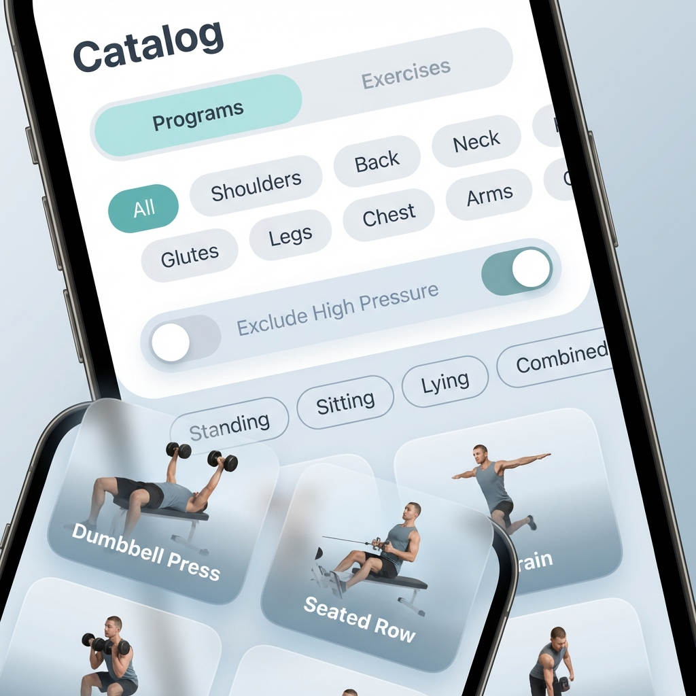

# PRD: Категоризация и фильтрация упражнений

## 1. Цель
Повысить удобство поиска упражнений и программ, а также обеспечить безопасность пользователей с ограничениями по внутрибрюшному давлению.

## 2. Анализ текущих данных
Упражнения в `App.js` (`EXERCISES`) имеют следующие поля: `id`, `title`, `equipment`, `description`, `duration`, `type`, `isStrength`.
Программы (`WORKOUTS`) имеют: `id`, `title`, `subtitle`, `duration`, `intensity`, `type`, `targets`, `color`, `exercises`.

## 3. Функциональные требования

### 3.1. Расширение модели данных упражнений
Добавить в каждое упражнение (`EXERCISES`) следующие поля:
- `zones`: массив строк (напр. `['плечи', 'трицепс']`).
- `pressureImpact`: булево значение (`true` - повышает внутрибрюшное давление, `false` - нет).
- `position`: строка (`standing`, `sitting`, `lying`, `combined`).

#### Таблица соответствия для текущих упражнений:

| ID | Название | Зоны | Повышает давление | Положение |
|---|---|---|---|---|
| `suboccipital_release` | Релиз основания черепа | Шея | Нет | `lying` |
| `upper_traps_ball` | Проработка трапеции | Плечи | Нет | `standing` |
| `thoracic_roll` | Прокатка грудного отдела | Спина | Нет | `lying` |
| `glute_roll` | МФР Ягодичных мышц | Ягодицы | Нет | `sitting` |
| `sacrum_release` | Релиз крестца | Ягодицы | Нет | `lying` |
| `dumbbell_row` | Тяга гантели в наклоне | Спина, Бицепс | Да | `combined` |
| `goblet_squat` | Кубковые приседания | Ноги, Ягодицы | Да | `standing` |
| `romanian_deadlift` | Румынская тяга | Ноги, Спина, Ягодицы | Да | `standing` |
| `overhead_press` | Жим гантелей стоя | Плечи, Трицепс | Да | `standing` |
| `floor_press` | Жим гантелей с пола | Грудь, Трицепс | Нет | `lying` |
| `lunges` | Выпады назад | Ноги, Ягодицы | Да | `standing` |
| `thoracic_extension` | Разгибание на ролле | Спина | Нет | `lying` |
| `cat_cow` | Кошка-Корова | Спина | Нет | `combined` |
| `child_pose` | Поза ребенка | Спина | Нет | `combined` |

### 3.2. Разделение по зонам
- В каталоге (раздел "Упражнения") добавить возможность группировки или фильтрации по зонам.
- Список зон: Плечи, Спина, Шея, Ягодицы, Ноги, Грудь, Руки (Бицепс/Трицепс).

### 3.3. Фильтрация по внутрибрюшному давлению
- В настройках профиля или в заголовке каталога добавить переключатель: "Исключить упражнения с повышением внутрибрюшного давления".
- При включении этого фильтра:
    - Упражнения с `pressureImpact: true` скрываются из списка упражнений.
    - Программы, содержащие ХОТЯ БЫ ОДНО такое упражнение, скрываются из списка программ.

### 3.4. Фильтрация по положению
- Добавить фильтр-чипсы (мультиселект) в каталоге: "Стоя", "Сидя", "Лежа", "Комбинированно".
- Фильтр применяется как к одиночным упражнениям, так и к программам.
  - Упражнение отображается, если его `position` совпадает с одним из выбранных.
  - Программа отображается, если ВСЕ её упражнения соответствуют выбранным положениям.

## 4. UI/UX требования

### 4.1. Макет интерфейса каталога
Ниже представлен концепт обновленного интерфейса каталога с новыми фильтрами.

*Концепт: Фильтрация по зонам, исключение давления и выбор положения.*

### 4.2. Детализация UI элементов
- **Фильтр зон**: Горизонтальный скролл чипсов (Shoulders, Back, Neck, etc.) под выбором типа контента.
- **Переключатель давления**: Акцентный Toggle-свитч с четкой подписью "Exclude High Pressure".
- **Фильтр положения**: Вторая строка чипсов (Standing, Sitting, Lying, Combined) для уточнения условий тренировки.
- **Карточка упражнения**: В правой части или под названием добавить компактный бейдж с иконкой и текстом положения (например, `🧍 Стоя`, `🪑 Сидя`, `🛌 Лежа`).

## 5. План реализации
1. Обновить константу `EXERCISES` в `App.js`.
2. Реализовать логику фильтрации в `WorkoutsView`.
3. Добавить UI элементы для управления фильтрами.
4. Сохранять состояние фильтров в `localStorage` (опционально, для удобства).
